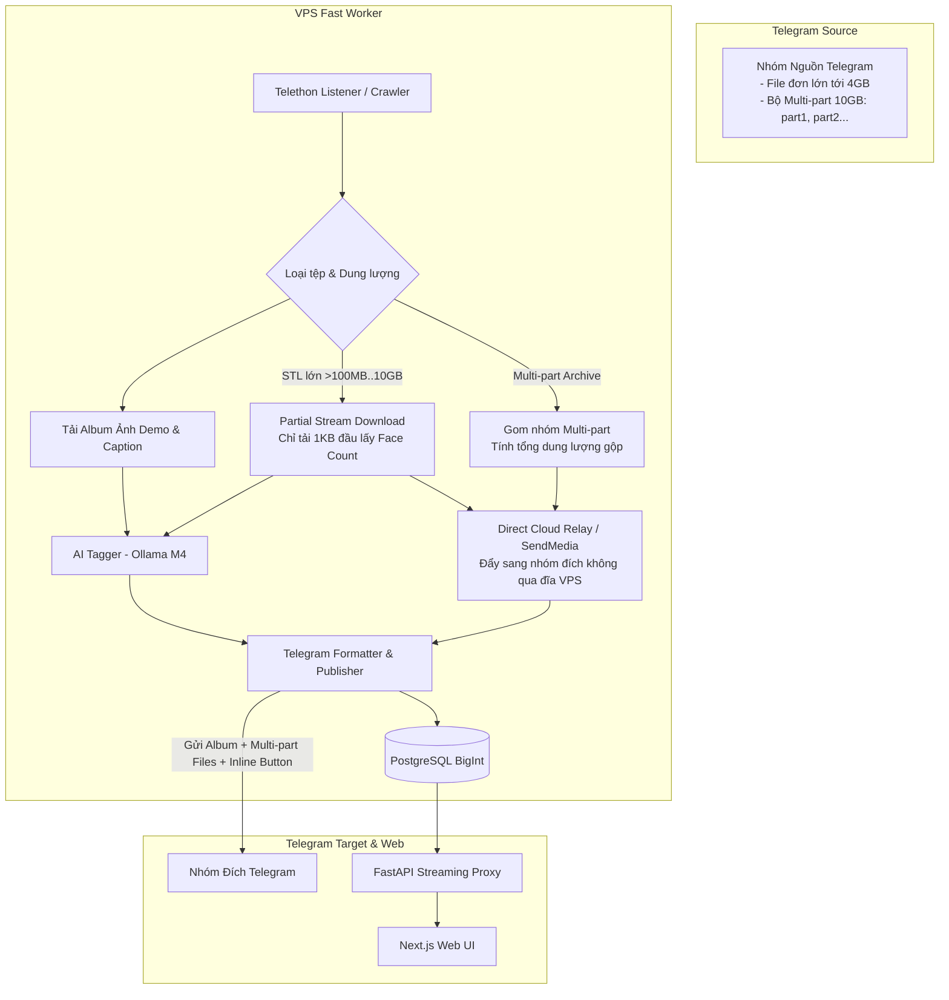

# Đặc Tả Kỹ Thuật: Hệ Thống Toàn Diện Lightweight Crawler, Fast STL Parser (Hỗ trợ File tới 10GB) & Nâng Cấp Giao Diện Web + Telegram

> **Ngày tạo:** 2026-08-28  
> **Trạng thái:** Đã phê duyệt (Approved)  
> **Phạm vi:** Hỗ trợ File Telegram lớn tới 10GB & Multi-part Archive, Fast Partial Header Parser, Direct Forwarding Zero-Disk, Database Schema, API Endpoints, Frontend Web Dashboard, Telegram Formatter

---

## 1. Tổng Quan & Mục Tiêu Cốt Lõi

1. **Hỗ Trợ File Lớn Lên Đến 10GB / Multi-part:**
   - **Direct Cloud Relay (Không tốn ổ cứng VPS):** Chuyển tiếp (forward/send_file) trực tiếp file lớn từ Telegram nguồn sang nhóm đích qua cloud Telegram mà không cần tải 10GB về đĩa VPS.
   - **Partial Chunk Download (Đọc Header từ xa):** Chỉ tải về đúng `1KB` đầu tiên qua stream MTProto để đọc 84-byte STL header (lấy Face count) mà không tải cả file 10GB.
   - **Nhận diện Multi-part Archive:** Tự động gom các file chia nhỏ (`.part1.rar`, `.part2.rar`, `.z01`, `.z02`...) thành một bộ sưu tập duy nhất với tổng dung lượng gộp.
2. **Ultra-Lightweight Backend:** Thay thế 100% `trimesh` & `pyrender` bằng **Fast Binary Header Parser**, giảm 95% RAM/CPU trên VPS, xử lý file trong `< 0.01s`.
3. **Quản Lý Bộ Nhớ & Dọn Dẹp Tuyệt Đối:** Cơ chế `try/finally` cưỡng chế xóa sạch tệp tạm sau khi xử lý, chống đầy ổ cứng 100%.
4. **Phát Hiện Pre-Supported & Studio:** Tự động nhận diện file có sẵn support (Chitubox, Lychee) và trích xuất thương hiệu Studio nổi tiếng (Sanix, Gambody, Wicked, Nomads...).
5. **Đăng Tải Telegram Chuyên Nghiệp:** Gom Album ảnh demo + File 3D (hoặc chuỗi multi-part) + Caption chi tiết + Nút bấm tương tác (Inline Buttons).
6. **Nâng Cấp Giao Diện Người Dùng (Frontend):**
   - 3D Viewer thông minh: Chỉ tải 3D khi là file STL/OBJ đơn; với file nén ZIP/RAR/Multi-part chuyển sang chế độ xem Album ảnh HD + danh sách Part.
   - Thêm Huy hiệu (Badge): 🟢 **Pre-Supported**, 🏷️ **Studio**, 📦 **Dung lượng lớn / Multi-part**.
   - Thêm nút liên kết: ✈️ **Mở trong Telegram**, 📥 **Tải nhanh Streaming không ngắt kết nối**.
   - Bổ sung bộ lọc: Lọc theo Studio, Lọc mô hình có Pre-Supported.

---

## 2. Kiến Trúc Xử Lý File 10GB (Streaming & Direct Relay)



---

## 3. Chi Tiết Kỹ Thuật

### 3.1. Partial MTProto Download (Đọc 84 Bytes từ xa không tải cả file)
```python
async def read_remote_stl_face_count(client, message) -> int:
    """Chỉ tải 1KB đầu tiên từ Telegram MTProto stream để đọc face count của file STL bất kể dung lượng 100MB hay 10GB."""
    try:
        header_bytes = b""
        async for chunk in client.iter_download(message.media, chunk_size=1024, request_size=1024):
            header_bytes += chunk
            if len(header_bytes) >= 84:
                break
        if len(header_bytes) >= 84:
            return struct.unpack("<I", header_bytes[80:84])[0]
    except Exception as e:
        logger.warning(f"Could not read remote STL header: {e}")
    return 0
```

### 3.2. Direct Forwarding (Zero-Disk)
```python
async def relay_file_to_target(client, target_chat_id, source_message, caption: str, buttons=None):
    """Gửi trực tiếp media sang nhóm đích qua cloud ID của Telegram, không tốn 1MB đĩa VPS."""
    return await client.send_file(
        target_chat_id,
        file=source_message.media,
        caption=caption,
        buttons=buttons,
        parse_mode="md"
    )
```

### 3.3. Database BigInteger & Multi-part Schema
- `file_size_bytes`: `BigInteger` (đảm bảo lưu trữ chính xác file 10GB+).
- `is_presupported`: `Boolean` (đánh dấu file có support).
- `studio_name`: `String(100)` (tên studio).
- `telegram_target_message_id`: `BigInteger` (ID tin nhắn bài đăng nhóm đích).
- `part_count`: `Integer` (số lượng part hoặc số file trong bộ nén).

---

## 4. Frontend UI Tối Ưu Cho File Lớn & Multi-part

1. **Hiển thị dung lượng thông minh:** Tự động chuyển đổi `MB` hoặc `GB` (ví dụ: `4.2 GB`, `9.8 GB`).
2. **Badge Multi-part:** Nếu là bộ sưu tập nhiều phần, hiển thị `📦 Bộ 4 Parts (9.5 GB)`.
3. **Streaming Download:** Backend stream trực tiếp từ Telegram chunks sang client qua HTTP stream, hỗ trợ Resume/Range header để trình duyệt tải file lớn không bị rớt mạng.
